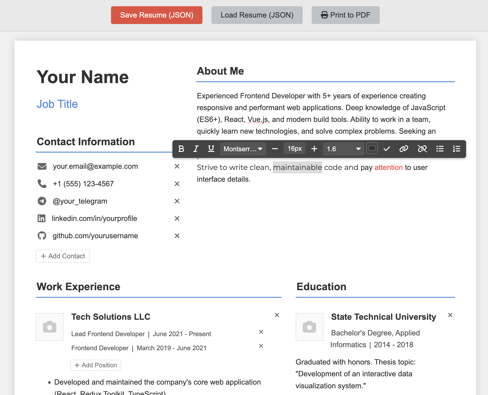

# Visual Resume Builder (AI-Generated)

## About This Project

This is a web-based, visual resume builder designed to help users easily create and customize professional-looking resumes. It features a drag-and-drop interface for arranging sections and content blocks, along with rich text editing capabilities.

*   [Link to Live Demo](https://armmurr.github.io/OfflineResumeBuilder/)

**This entire project, including its HTML, CSS, and JavaScript code, was generated through interaction with an AI assistant.**

## Compatibility Notice

**Please note:** This application has been primarily developed and tested using **Google Chrome on desktop operating systems (Windows, macOS, Linux)**. While it might partially function in other browsers or on mobile devices, **correct and stable operation is only guaranteed in the specified environment.** Use in other browsers or platforms may lead to unexpected behavior or visual glitches.

## Key Features

*   **Visual Drag & Drop Interface:** Easily rearrange entire sections or individual content blocks within columns using SortableJS.
*   **Multiple Section Layouts:** Choose between full-width sections or two-column layouts.
*   **Customizable Columns:** Adjust the width ratio of columns in two-column layouts.
*   **Section Styling:** Customize the font family and H2 heading underline color for each section independently.
*   **Pre-defined Content Blocks:** Includes common resume blocks like:
    *   Name & Job Title
    *   Contact Information (with selectable icons)
    *   About Me / Summary
    *   Work Experience (with logo upload, multiple positions per company)
    *   Education (with logo upload)
    *   Skills
    *   Languages (with proficiency level selection)
    *   Custom Blocks for additional information.
*   **Rich Text Editing:** A contextual toolbar (powered by Rangy) appears when text is selected, allowing for:
    *   Bold, Italic, Underline
    *   Font Family Selection (includes standard & Google Fonts)
    *   Font Size Adjustment (Increase/Decrease)
    *   Text Color Selection
    *   Bulleted and Numbered Lists
    *   Link Creation/Removal
    *   Line Height Adjustment
*   **JSON Export/Import:** Save your resume progress to a JSON file and load it back later.
*   **Print Functionality:** A dedicated "Print Resume" button opens the browser's print dialog, formatted using print-specific CSS rules.
*   **Print-Friendly CSS:** Basic print styles are included to hide controls and format the resume layout for printing or saving as PDF.

## Purpose

This application was created with two main goals:

1.  **To provide a free, accessible, and user-friendly tool** for anyone needing to generate a resume quickly without complex software.
2.  **To demonstrate the capabilities of modern AI** in developing a functional web application from scratch, even for users with minimal programming knowledge, by using appropriate prompts and guidance.

## ⚠️ Disclaimer: Code Quality and AI Generation

**Please be aware of the following:**

*   **AI-Generated Code:** As stated, the **entire codebase** was generated by an AI.
*   **Development Focus:** The primary focus during development was **rapid functionality and feature implementation**, driven by AI interaction, rather than code optimization, architectural purity, or adherence to best practices.
*   **Lack of Optimization & Modularity:** Consequently, the code is **not optimized** for performance or maintainability. It is largely **monolithic** (not broken down into clean modules).
*   **NOT FOR REFERENCE:** This codebase **should NOT be used as a reference** for learning web development, JavaScript best practices, or software architecture. It is purely a result of guided AI generation aimed at producing a working tool quickly.
*   **Not Representative of Personal Skills:** The code **does not reflect** the author's personal programming skills, style, or understanding of software design principles.
*   **Potential Improvements:** Given more development time and a focus on manual coding standards, the codebase could be significantly cleaner, more modular, optimized, and better structured.

This project exists primarily as a functional tool and a demonstration of AI-assisted development under specific constraints (speed, minimal prior coding by the user).

## How to Use

1.  Clone or download this repository.
2.  Open the `index.html` file in your web browser.
3.  **Note:** An active internet connection is required the first time you use Google Fonts within the editor, as they need to be downloaded and cached by your browser. Standard system fonts will work offline.
4.  Use the visual interface to build your resume.
5.  Use the "Save Resume (JSON)" button to save your progress.
6.  Use the "Load Resume (JSON)" button to load a previously saved resume.
7.  Use the "Print Resume" button to open the print dialog.

*   [Link to Live Demo](https://armmurr.github.io/OfflineResumeBuilder/)

## Open Source Software Used

This project utilizes open-source software. Please see the `thirdparty/THIRD_PARTY_LICENSES.md` file for details on the licenses.

## License

The specific code generated for *this* project is licensed under the MIT License. See the `LICENSE` file for details.